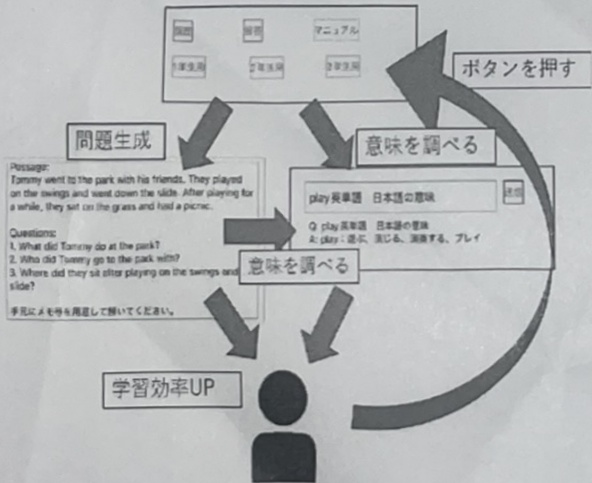

時間や外出先における学習を可能とし、学習機会の拡張に寄与する点も特長の一つである。

最後に、図 3.16 に本システムの全体構成図を示す。利用の流れとしては、学習者がボタンを押すことで ChatGPT により新たな問題が生成され、分からない単語については ChatGPT に直接質問して意味を調べる。その後、問題を解き、解答を確認し、再びボタンを押すことで新たな問題が生成される。このサイクルを繰り返すことで、多様な英語長文問題に触れながら、自ら未知語を調べて学習を進めることができ、最終的に理解度の向上が期待される。

図 3.16 システム構成図

## 4. 評価実験

## 4.1 実験設定

本システムの有用性を検証するため、2週間の評価実験を実施した。対象は学習指導塾に通う中学生5名（1年生1名、2年生2名、3年生2名）とした。各生徒にはシステムを実際に使用してもらい、その後に4段階評価と自由記述による感想を回答してもらった。

評価は以下の3項目について行った。

1. 使いやすさ

2. 学習効率の良さ

3. 生成される英文の質

各項目について、A（良い）～D（悪い）の4段階で評価を求めた。また、評価結果を定量的に分析するため、A=4点、B=3点、C=2点、D=1点として数値化した。各項目の得点を合計し人数で割ることで平均値を算出し、次の基準に従って総合評価を行った。

・A評価：4.0～3.5

• B 課価：3.4～2.5

• C 評価：2.4 ~ 1.5

・D評価：1.4～0.0

## 4.2 実験結果

表 4.1 実験結果

<table><tr><td>生徒氏名（イニシャル）</td><td>学年</td><td>使いやすさ</td><td>学習効率の良さ</td><td>出力される英文の質</td></tr><tr><td>SN</td><td>1年</td><td>A</td><td>A</td><td>B</td></tr><tr><td>AY</td><td>2年</td><td>A</td><td>B</td><td>D</td></tr><tr><td>IN</td><td>2年</td><td>A</td><td>C</td><td>C</td></tr><tr><td>SY</td><td>3年</td><td>A</td><td>B</td><td>A</td></tr><tr><td>TM</td><td>3年</td><td>B</td><td>B</td><td>D</td></tr><tr><td></td><td>平均</td><td>3.8</td><td>3</td><td>2.2</td></tr><tr><td></td><td>総合評価</td><td>A</td><td>B</td><td>C</td></tr></table>

表 4.1 に評価実験の結果を示す。使いやすさについては、多くの生徒から A 評価を得ることができた。一方で、学習効率の良さは B 評価が多く、生成される英文の質に関しては C や D 評価が目立つ結果となった。

生徒から寄せられた感想としては、「画面がシンプルで、分からない単語を調べられるため学習が捗った」といった肯定的な意見がある一方で、「生成される長文が難しい」「出題される文法を絞り込みたい」「使いやすいが見たことのない単語が含まれていた」といった改善要望も挙げられた。

総合的に見ると、本システムは シンプルで扱いやすい学習支援ツール として評価された。しかしながら、生成される英文の難易度にはばらつきがあり、未知語も含まれる傾向が見られた。ただし、未知語については ChatGPT による即時検索機能を通じて調べることが可能であり、致命的なデメリットとはならないことが確認された。

## 5. 考察・展望

## 5.1 試作システムの考察
