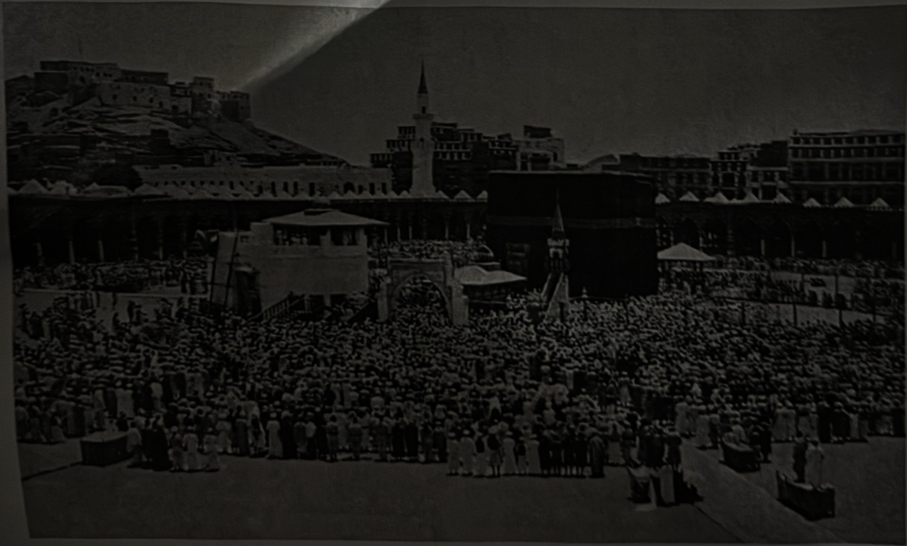

## 나의 사랑하는 예언자 살 알라후 알라이히 와살람

그 이튿날 꾸라이쉬 사령관이 쿠라이자 부족에게 통지하였다. “이제 우리가 여기에 머무는 것이 아주 어렵게 되었습니다. 날씨가 매우 춥고, 우리 동물들이 굶어죽고 있기 때문입니다. 오늘밤에 만반의 준비를 갖추었다가 내일 맹렬한 공격을 가합시다.” 유대인들이 응답했다. “첫째, 우리는 안식일(토요일)에는 전쟁을 하지 않습니다. 둘째, 우리가 전쟁에 참여하려면 여러분이 인질을 제공해야 합니다. 포위기간이 길어져 당신들이 할 수 없이 철수하고 나면 우리를 무함마드(알라히살람)에게 받치는 것이 됩니다. 당신들이 인질을 제공하면 당신들은 우리를 남기고 돌아가지 않을 것입니다.” 이러한 소식을 들은 꾸라이쉬 사령관이 말했다. “과연 누아임의 말이 사실이었군!” 그는 다시 유대인에게 전갈을 보냈다. “우리는 인질을 제공할 수 없다. 내일 여러분이 우리와 함께 싸운다면 매우 좋은 일이 될 것이다. 그렇지 않다면 우리는 고향으로 돌아가고 여러분 홀로 무함마드(알라히살람)과 그 교우들을 상대해야 할 것이다.”

쿠라이자 유대인들이 그 소리를 듣고 보니 과연 누아임 성인의 말이 현실로 드러나고 있었다. 그들은 대답했다\. “이러한 경우라면 우리는 당신들과 연합하지도 않을 것이고, 무슬림과도 싸우지 않을 것이오\.” 그리하여 두 집단의 마음은 공포 속으로 빠져들었다\.

지브릴 천사가 알라후 테알라의 사도에게 와서 지고하신 알라후 테알라께서

메디나 알 무나와라와의 옛 모습(1890년)

297
