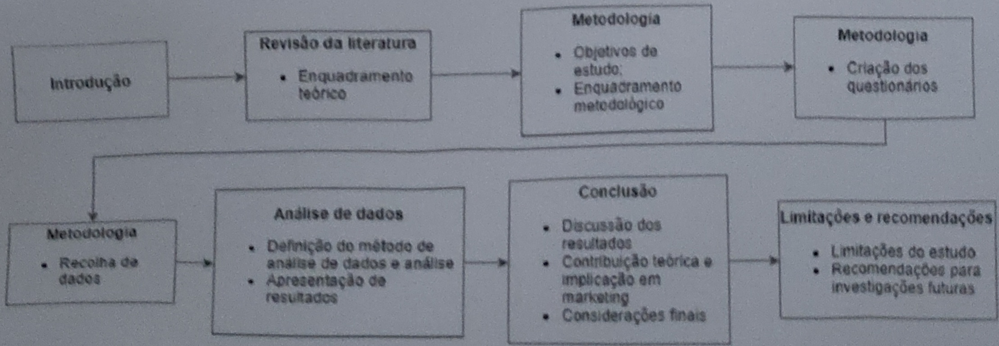

IPAM

LALIREATE INTERNATIONAL UNIVERSITIES

c) Como é que a apresentação dos produtos em modelos mais próximas fisicamente dos consumidores influencia o seu processo de tomada de decisão?

A tese irá dividir-se em cinco capítulos (Figura 1). No primeiro capítulo será feita uma revisão de literatura sobre o tema e será desenvolvido o enquadramento teórico para o estudo; o segundo capítulo foca-se na metodologia da investigação, tendo como base a definição dos objetivos de estudo, conceptualização do modelo de análise e apresentação do enquadramento metodológico- mais concretamente a metodologia utilizada e a justificação para a mesma e o desenvolvimento do questionário e justificação das questões e estrutura utilizadas; o terceiro capítulo debruça-se sobre a definição do método de análise dos dados recolhidos e apresentação dos resultados; no quarto capítulo é desenvolvida a conclusão do estudo com a discussão dos resultados obtidos, a contribuição teórica e implicações do estudo em marketing e considerações finais sobre a investigação, e no último capítulo são apresentadas as limitações do estudo e recomendações para futuras investigações.

Figura 1. Estrutura da investigação. Fonte: Elaboração própria.

Patricia Catarino (219151)

10
