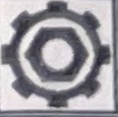

Металлургия и материаловедение
Metallurgy and Materials Science

- подготовка кадров.

Как видно из вышеизложенного, одним из основных стратегических направлений развития литейного производства на современном этапе - это развитие моделирования и компьютерных технологий.

Развитие моделирования и компьютерных технологий предполагает:

- моделирование формирования отливки в форме – система синтеза по всем элементам процесса [11];

– автоматизированное проектирование литейной технологии;

– проектирование литейной технологии и оснастки в CAD-системе с последующим её изготовлением на станках с числовым программным управлением (ЧПУ);

– разработка системы быстрого прототипирования;

– компьютерное управление технологическим оборудованием [12, 13].

Сегодня в мире насчитывается большое количество программ для моделирования литейных процессов. В мировой практике основное распространение получили программы, представленные в таблице

que

К сожалению, российским специалистам известны лишь такие программы, как Magmasoft, PROCast, SolidCast, а также две отечественные разработки – «Полигон» и LVMFlow.

Основные проблемы при выборе конкретной программы для моделирования технологических процессов состоят в отсутствии достоверной информации о возможностях самой программы, принципах работы с ней, а также в отсутствии специалистов на предприятиях России. Существенным фактором для отечественных предприятий при выборе программы для моделирования литейных процессов остается ее стоимость [14].

Программы для моделирования литейных процессов, используемые сегодня в России, в основном различаются степенью полноты факторов, учитываемых при моделировании, и, соответственно, стоимостью. Второе существенное различие связано с методами получения и решения уравнений: уравнения тепломассопереноса могут быть записаны в дифференциальном или интегральном виде.

Программы для моделирования литейных процессов и страны создатели
Programs for casting process simulation and the country of origin

<table><tr><td>Страна -разработчик</td><td>Программа</td><td>Страна-разработчик</td><td>Программа</td></tr><tr><td>Германия</td><td>Magmasoft</td><td>США</td><td>Flow3D</td></tr><tr><td>Германия</td><td>WinCast</td><td>США</td><td>PowerCast</td></tr><tr><td>Франция</td><td>PROCast</td><td>США</td><td>SolidCast (AFSolid)</td></tr><tr><td>Франция</td><td>QuikCast</td><td>США</td><td>CAPCast</td></tr><tr><td>Франция</td><td>PAM-Cast</td><td>США</td><td>RAPID/CAST</td></tr><tr><td>Франция</td><td>CalcoSoft</td><td>Корея</td><td>AnyCasting</td></tr><tr><td>Испания</td><td>Vulcan</td><td>Финляндия</td><td>CastCAE</td></tr><tr><td>Япония</td><td>JSCAST</td><td>Россия, г. Ижевск</td><td>LVMFlow</td></tr><tr><td>Россия, г. Санкт-Петербург</td><td>Poligon («Полигон»)</td><td>Россия, г. Москва</td><td>FlowVision</td></tr><tr><td>Англия</td><td>Mavis-Flow</td><td>Индия</td><td>AutoCast</td></tr><tr><td>Китай</td><td>InteCast</td><td>Австралия</td><td>Castflow, Castherm</td></tr></table>

ISSN 1814-3520 ВЕСТНИК ИРГТУ Том 22, № 11 2018 / PROCEEDINGS of ISTU Vol. 22, No. 11 2018 211
